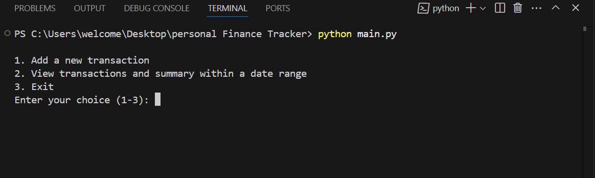

# 1. Personal-Finance-Tracker 📊
This is a simple command-line application to help you track your personal finances.
You can add income and expense transactions, view summaries for a date range, and visualize your financial data with plots.

# 2. Features 🔗
    -Add new transactions (income or expense) with date, amount, category, and description.

    -View all transactions and summary (total income, total expense, net savings) within a custom date range.

    -Visualize income and expenses over time using matplotlib plots.

    -Data is stored in a CSV file for easy access and backup.

# 3. Requirements 🙋🏻‍♂️
    Python 
    pandas
    matplotlib

# 4. Options
1.**Add a new transaction**

2.**View transactions and summary within a date range**

3.**Exit**

